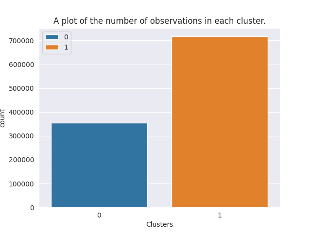
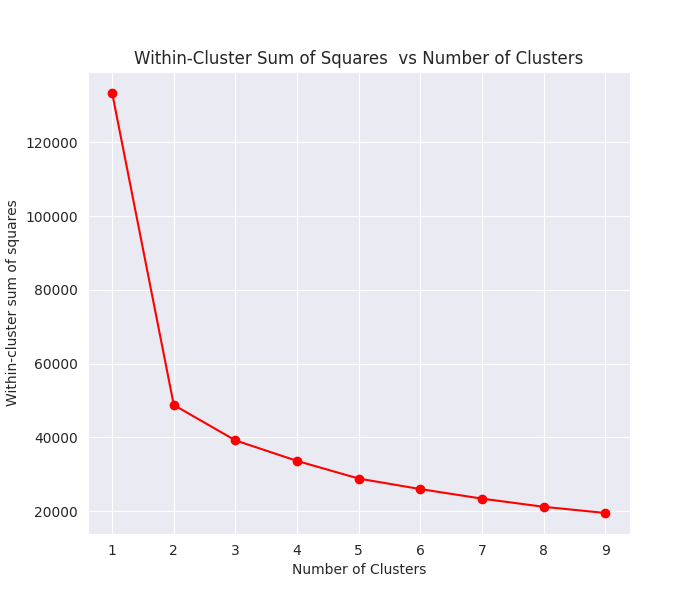
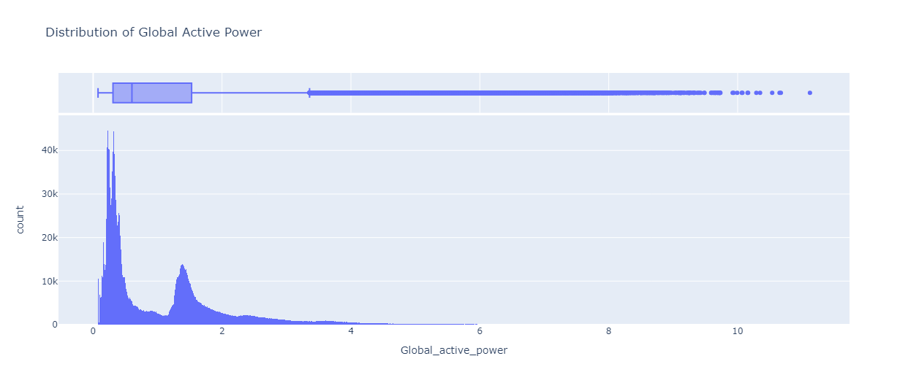
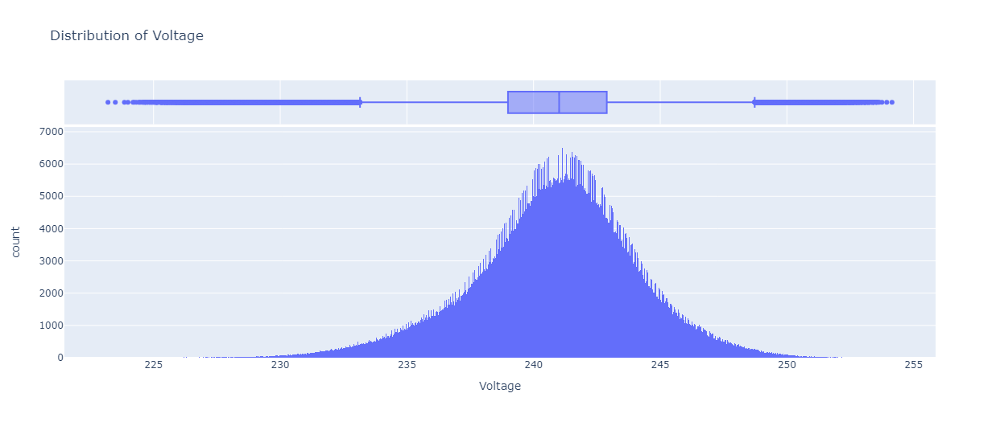

# Clustering of Electricity Consumption in a Houshold using K-Means.

## Table of contents
- [Overview](#overview)
    - [Screenshot](#screenshot)
    - [Links](#links)
- [Process](#process)
    - [Procedure](#procedure)
    - [Tools used](#tools-used)
- [Author](#author)
- [Acknowledgement](#resources)

## Overview
### Screenshot

### Links
- [Github repository](https://github.com/Emmanuel-Afrifa/Clustering-of-electricity-of-consumption-using-k-means-clustering)

## Process
### Procedure
    - Exploration of the data to uncovre relationships among the features of the dataset.
    - Using the Elbow method to find the optimal number of clusters ($k$)
    - Using the value of $k$ determined above to build a clustering model
    - Using Principan Component Analysis (PCA) to reduce the dimension of the data to enable us to visualize it.

### Tools Used
- Python Programmin Language
    - Numpy
    - Pandas
    - Seaborn
    - Plotly.express
    - Sklearn

## Author
- Emmanuel Afrifa
- [emmaquame9@gmail.com](mailto:emmaquame9@gmail.com)
- [Twitter](https://twitter.com/Emma33712365)
- [Linkedin](https://www.linkedin.com/in/emmanuel-afrifa-840674214/)

## Resources
- [Dataset](https://archive.ics.uci.edu/dataset/235/individual+household+electric+power+consumption)
- [Downloading subtly cleaned data](https://drive.google.com/file/d/1tg27OlWWOAP-5k1aQoWiyQZJN7mifqCY/view?usp=drive_link)
